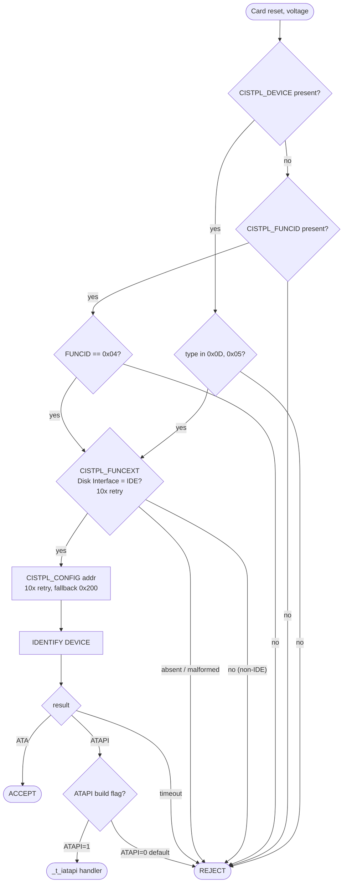
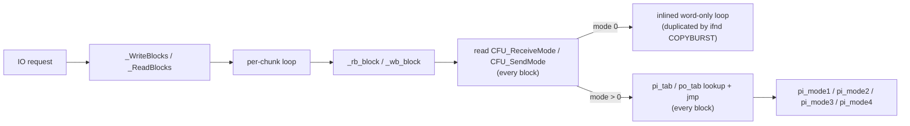
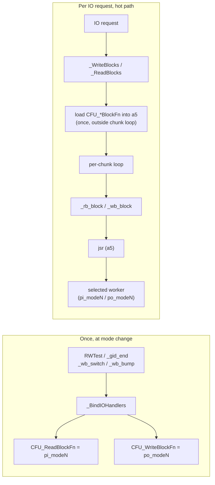

# CompactFlash device in PCMCIA driver for AmigaOS.

`compactflash.device` is an AmigaOS driver for CompactFlash cards in PCMCIA slots. Fork of the original driver by Torsten Jager (Aminet: [disk/misc/cfd.lha](https://aminet.net/package/driver/media/cfd), [disk/misc/CFD133.lha](https://aminet.net/package/driver/media/CFD133)).

## compactflash.device driver

**Download**: at GitHub [Releases](https://github.com/pulchart/cfd/releases)

**Purpose**

Access digital photos, MP3 files, and other media directly from CompactFlash cards. The AmigaOS-supplied `carddisk.device` cannot properly handle CF cards, this driver provides a reliable alternative.

**Personal Note**

This driver is maintained and improved in my free time. If you'd like to support ongoing maintenance and experimentation, you can do so on [Ko-fi](https://ko-fi.com/jaroslavpulchart). You can also follow project planning and updates here: [Planning for 2026](https://ko-fi.com/post/Planning-for-2026-S6S81S7IZH).

**Community Links**

- **English Amiga Forum Thread:** [Discussion Thread](https://eab.abime.net/showthread.php?t=121575) for user questions and troubleshooting.
- **Aminet CFD Advanced Search:** [CFD releases (m68k, AmigaOS)](https://aminet.net/search?type=advanced&name=cfd&q_path=AND&path%5B%5D=driver&q_date=AND&o_date=equal&date=&q_desc=OR&desc=&q_readme=AND&readme=&q_content=AND&content=&q_arch=AND&arch%5B%5D=m68k-amigaos&search=search) shows all CFD packages, including v1.34+.

## What's New in

### 20260604-dev

#### Driver

* **Fixed a crash in the ROM-resident driver when running WHDLoad.** (Issue #56) Programs that take over the machine flush idle libraries and devices to free memory before they run. The idle ROM-resident compactflash.device looked unused, got flushed, and that corrupted the program's memory setup, causing a guru (`0x0100000F`, bad `FreeMem`). Mounting a CF card first avoided it (the filesystem then held the device open), and so did WHDLoad's `NoFlushMem` option. The driver now keeps itself in use.

* **Non-IDE PCMCIA cards (e.g. ATAPI CD/DVD adapters) are now released earlier in the identify process.** (Issue #47) Rejecting after IDENTIFY is too late: the IDENTIFY attempt could leave the card in a state where dedicated drivers (such as `telmexatapi.device`) could no longer claim it. The CIS gate reintroduced checks for a well-formed Disk Interface FUNCEXT declaring IDE before IDENTIFY runs, with up to 10 retries to tolerate unstable CIS reads. Please report if you see any CF card detection regression.

* **ATAPI handler compiled out by default.** Build with `ATAPI=1` to keep it. See [ATAPI status](#atapi-status) for details.

#### Tools

* **`pcmciacheck -cis`**: new option that prints a readable summary of the identification data carried by the inserted PCMCIA card (manufacturer, card type, version, etc.). Handy when you want to understand why an unusual card is or isn't accepted by the driver, or when reporting a problem card.

#### Packaging

* **Archive version is now a date (YYYYMMDD).** The release bundle ships several independently-versioned pieces (`compactflash.device`, `ptable.library`, `CFInfo`, `pcmciaspeed`, `pcmciacheck`), each on its own cadence, so a single `v1.x` number for the whole archive never matched what was actually inside. The archive (`cfd.vYYYYMMDD.lha`) is now named after its release date, while each component keeps its own version, visible via `version <name>`. No installation steps change.

<!-- COMPONENTS:BEGIN -->
#### Components in this release

- compactflash.device 1.44-dev (04.06.2026)
- ptable.library 1.0 (16.05.2026)
- CFInfo 1.37 (11.01.2026)
- pcmciaspeed 1.36 (02.01.2026)
- pcmciacheck 1.39 (22.05.2026)
<!-- COMPONENTS:END -->

<details>
<summary>Older releases</summary>

### v1.43 (19.05.2026)

#### Driver

* **Fix hot-plug regression introduced in v1.41**: inserting or removing a CF card no longer fails to notify filesystem handlers that live in a Kickstart ROM (e.g. fat95 in a custom ROM). Affected setups saw the card mount correctly but silently skip hot-plug events after that. With `Flags = 8` the bug was visible in the serial log as a spurious `..drop stale client` line on card removal:
  ```
  [CFD] Card removed
  [CFD] ..client IS_Code=0x00E4D3AA
  [CFD] ..drop stale client at 0x403DFC00
  ```

### v1.42 (16.05.2026)

This release introduces **autoboot and automount from RDB-partitioned CF cards**.

#### Driver

* **Autoboot from RDB at cold-boot**: a bootable RDB partition on the inserted card boots straight into Workbench. All RDB partitions appear   at cold start without `DEVS:DOSDrivers/` entries. Filesystem handlers stored on the card are loaded automatically. Requires `ptable.library` to be ROM-resident; disk-only install is mountable-only without it. When a card is present and stable all loops exit on the first iteration. The worst-case extra delay (~1.8 s) is paid once on the first `OpenDevice` with no card inserted.

* **Stricter CIS gate**: as the CIS detection code improved over time, the fallback that accepted cards without a readable `CISTPL_FUNCID` was dropped. Such cards now fail the CIS gate, freeing them for their proper driver.

#### Others

* Release archive version and compactflash.device version are now tracked independently (Makefile change)
* New distribution layout: two build flavors per CPU tier in dedicated folders. `dist/full/<cpu>/` as debug-capable (serial output enabled) and `dist/small/<cpu>/` without any debug output via serial line, The `<cpu>` is `68000` for any 68k or `68020` for 68020+.

### v1.41 (18.04.2026)

This release focuses on stability and CPU compatibility improvements across both shipped CPU tiers (`68000` / `68010` and `68020+`).

#### Driver

* **IO path streamlined**: internal cleanup in the IO path (see [IO path dispatch](#io-path-dispatch))
* **The driver now ships two CPU tiers**:
  - `68020+` at `devs/68020/compactflash.device` (A1200 stock, and 68020+ accelerators: 030/040/060/080)
  - `68000` at `devs/68000/compactflash.device` (stock A600)
* **68020+ build uses native 32-bit math**: `mulu.l` / `divul.l` / `bfffo` are inlined at the call sites via macros and fully replace the 68000 compatibility routines (which are excluded from the 020+ binary). No functional change.

#### Others

* Experimental `COPYBURST` build option removed (had no effect in practice).

### v1.40 (12.04.2026)

#### Driver

* **CIS gate accepts only known CompactFlash device types** ([#38](https://github.com/pulchart/cfd/issues/38))
  - Accepts cards whose CIS reports device type `0x0D` (FUNCSPEC) or `0x05` (FLASH), the two types CompactFlash cards are known to use.
  - Other memory-card types are rejected early, so the driver no longer tries ATA IDENTIFY on cards that are not expected to behave like ATA devices and will not get stuck on them. (see [CIS gate decision](#cis-gate-decision))

#### Others

* Rebuild by vasm 2.0e

### v1.39 (10.02.2026)

#### Driver

* **Checking stability of I/O port access** ([#33](https://github.com/pulchart/cfd/issues/33)) -- Cards with unreliable data transfer are now detected and rejected to prevent data corruption. Thanks to [Freddy](https://www.amigaportal.cz/member/2607-freddy) for sending the CF card for analysis.

#### Others

* git repository restructured
* Rebuild by vasm 2.0d

### v1.38 (27.01.2026)

#### Driver

Reworks CIS handling to avoid side effects with non-storage PCMCIA cards (e.g. WiFi) and restores PCMCIA (Gayle) timing setup.

* **CIS gate (PCMCIA card type filter)** ([#25](https://github.com/pulchart/cfd/issues/25))
  - Reads `CISTPL_FUNCID` (when available) and rejects non-disk cards early to avoid interfering with other PCMCIA devices (e.g. WiFi).
  - If `CISTPL_FUNCID` is missing/unreadable, the driver continues for compatibility (some CF cards/adapters do not provide reliable CIS tuples).

* **PCMCIA (Gayle) timing setup**
  - Restores access timing setup from `CISTPL_DEVICE` via `CardAccessSpeed` (v1.37 didn't program timing based on CIS speed).

#### Tools

* **pcmciacheck simplifies test output**

#### Others

* documentation improvements

### v1.37 (17.01.2026)

#### Driver

* **Improved card detection reliability**
  - Fixes unreliable CopyTuple CIS reads by using the card's ATA IDENTIFY data instead. Seen with Transcend CF 133 4GB (Firmware 20110407) and ACA1234.
  - The config address is still read from the card CIS when available, with an automatic fallback to the standard address.
  - `Flags = 2` is deprecated (the fallback is now automatic).

* **Autodetect multi-sector override capability**
  - Driver estimates by simple test during init if multi-sector override works
  - If test passes (DRQ clears properly), 256 sector mode is enabled for best performance
  - If test fails (DRQ stays high), falls back to firmware-reported value for compatibility
  - `Flags = 16` still available as manual override to force 256 sector mode
  - `Flags = 32` skips auto-detection and uses firmware-reported value directly
  - Debug output shows detection result: "DRQ issue not detected" / "DRQ issue detected"

* **CFD_GETCONFIG command (0xED)**
  - New SCSI passthrough command to retrieve driver internal configuration

#### Tools

* **CFInfo shows driver configuration**
  - Displays mount flags, multi-sector settings (firmware vs actual)
  - Requires driver v1.37+ for config display (card info still works with v1.36+)

* **pcmciacheck tests all 5 transfer modes**
  - Added mode 4 (MMAP) memory-mapped transfer testing

#### Others

* Typo fixes throughout documentation

### v1.36 (08.01.2026)

#### Driver

* **MuForce hit fix when using Format** ([#8](https://github.com/pulchart/cfd/issues/8))
  - Fixed memory access issue detected by MuForce during disk formatting operations
* **Clear stale card data on removal**
  - CFU_IDEStatus, CFU_IDEError, CFU_IDEAddr, CFU_ConfigAddr cleared when card is removed
  - CFU_MultiSize, CFU_MultiSizeRW cleared to reset multi-sector settings
  - 512-byte IDENTIFY buffer (CFU_ConfigBlock) fully cleared - prevents stale model/serial/firmware/capacity data
  - Prevents returning stale data when no card is present or after card swap
* **SD-to-CF adapter retry fix**
  - when ATA IDENTIFY retries exhaust (regression in v1.33), now tries ATAPI IDENTIFY PACKET DEVICE before giving up (as v1.32)
  - Fixes potential hang on SD-to-CF adapters
* **Implement ATA_IDENTIFY command**
  - retrieve the cached ATA IDENTIFY data from the driver

#### Tools

* **CFInfo utility**
  - displays card model, serial, firmware, capacity, and capabilities
* **pcmciaspeed utility**
  - Recreated PCMCIA memory access timing benchmark tool
* **pcmciacheck utility**
  - Recreated PCMCIA check tool

#### Others

* **AmigaGuide documentation**
  - Native Amiga .guide files included in release
* **Gayle memory timing**
  - Experimental: disabled by default, compile with `GTIMING=1` to enable
  - Maps card's ATA PIO mode to Gayle PCMCIA memory timing
* **Improved code documentation**
  - Architecture overview with register conventions
  - Documented CFU structure fields
  - Added function headers with input/output/register usage

### v1.35 (31.12.2025)

* **Serial debug output** - set `Flags = 8` to enable debug messages via serial port
  - Shows card insert/remove, identification, size, and MultiSize
  - Replaces cfddebug tool with readable text-based serial output
* **Enforce multi mode** - set `Flags = 16` to force 256 sector reads/writes per IO request, even if card firmware does not support it
  - Can improve performance on capable cards (1MB/s → 2MB/s)
  - **Warning:** May cause data corruption on unsupported cards - see Enforce Multi Mode section below
* **Simplified SD-to-CF adapter support** - cleaner retry mechanism for IDENTIFY command introduced in v1.33

### v1.34 (22.10.2025)

* Improved compatibility with >=2014 Firmware CF cards
  - Workaround for "get IDE ID" on large capacity cards
  - Multi-sector IO uses firmware reported value to improve compatibility

</details>

## System Requirements

* Amiga 1200 or 600 (A1200 tested)
* AmigaOS 2.0+ (tested with 3.2.3)
* CF-to-PCMCIA adapter or SD-to-CF adapter (see [Hardware Notes](#hardware-notes))
* Works with fat95 filesystem for FAT32 support (disk/misc/fat95.lha) or native (FFS, SFS, PFS) filesystems if RDB partition table is used

## Installation

The archive ships two flavours (`full` / `small`) and two CPU tiers (`68020+` / `68000`), each as a partial sysroot ready to drop onto `SYS:`. The flavour is encoded in the path:

| Flavour | CPU Tier | File | Size |
|---------|------|------|------|
| full | 68020+ | full/68020/devs/compactflash.device | ~11.7 KB |
| small | 68020+ | small/68020/devs/compactflash.device | ~8.6 KB |
| full | 68000+ | full/68000/devs/compactflash.device | ~11.8 KB |
| small | 68000+ | small/68000/devs/compactflash.device | ~8.8 KB |

Companion `ptable.library` binaries live next to the device in the same flavour/CPU tree (`<flavour>/<cpu>/libs/ptable.library`).

Pick the tier that matches your CPU, then pick the full or small flavour:
- Use the **full** version if you want serial debug output (`Flags = 8`)
- Use the **small** version for minimal memory footprint

```
# A1200 (68020+) full flavour
Copy from cfd/full/68020/  to SYS:   ALL

# A600 (68000) full flavour
Copy from cfd/full/68000/  to SYS:   ALL

# Plus the shared tools
Copy cfd/c/CFInfo to C:
```

The inner `devs/` and `libs/` drawers map directly onto `SYS:Devs/` and `SYS:Libs/`, so a single `Copy ALL` of `<flavour>/<cpu>/` installs both the device and `ptable.library` at once.

Have fat95 installed on your system. Mount the drive by double-clicking `Storage/DOSDrivers/CF0`.

For OS 3.5+:
```
Copy def_CF0.info sys:prefs/env-archive/sys
Copy def_CF0.info env:sys
```

## Autoboot / Automount (ROM-resident)

At Kickstart cold start `compactflash.device` opens `ptable.library`, which walks the RDB on the inserted card, registers any filesystem handlers stored in the RDB into `FileSystem.resource`, and publishes each partition via `AddBootNode` (bootable) or `AddDosNode` (mountable only).

*ROM-resident requirement*

`ptable.library` is **optional** for the driver. Without it, `compactflash.device` still works fully as a mount-only device via `DEVS:DOSDrivers/CF0` as example. It is **required** for autoboot and automount. To activate, both compactflash.device and ptable.library must be flashed into a ROM image.

*Building your own ROM*

A scripted Capitoline-based ROM builder for creating a 1 MB AmigaOS 3.2.3 / 3.1 / 2.05 Kickstart with `compactflash.device` + `ptable.library` embedded lives in the companion [amigaos-kickstart-builder](https://github.com/pulchart/amigaos-kickstart-builder) repo.

*Partition handling*

How each RDB partition is handled at boot:

| RDB partition flag | BootPri | Result |
|--------------------|---------|--------|
| normal | ≥ 0 | bootable: appears in Early Startup boot device list |
| normal | < 0 | non-bootable: mounted as a DOS volume |
| NOMOUNT (bit 1 set) | any | skipped entirely: not mounted, not in DOS list |

BootPri is stored in the RDB partition environment and controls boot order.

*Boot order*

The driver starts during Kickstart boot after the internal IDE is ready. The relevant modules in boot order are:

| Module | Role |
|--------|------|
| `card.resource` | PCMCIA slot initialised |
| `trackdisk.device` | floppy |
| `carddisk.device` | Kickstart built-in PCMCIA handler |
| `scsi.device` | internal IDE initialised |
| **`compactflash.boot`** | **CF card check + partition scan**. It opens `ptable.library`. `ptable.library` walks the RDB, registers any filesystem handlers it finds, and publishes each partition via `AddBootNode` (bootable) or `AddDosNode` (mountable only). |
| `strap` | boot menu / Workbench start |

The driver runs after the internal IDE is initialised, so it does not interfere with it. If the IDE stalls at boot (e.g. no drive connected), CF autoboot will not trigger either.

*Cold-boot timing*

The boot stub starts with a **no-card pre-gate**: a single read of the Gayle tells it whether a CF card is in the slot. If the slot is empty, the stub returns immediately.

If a card IS present, the driver tolerates slow cards/adapters by polling for up to ~1.8 s in total (1 s for card-detect stabilisation, ~400 ms each for the two CIS tuple reads). Stable cards complete the first iteration of each loop, so a healthy card pays no measurable delay.

*Boot debug output*

`ptable.library` opens the device with `Flags=0`. Serial debug output at cold boot comes from a `full` build only and is unconditional, not gated by the mountlist `Flags = 8` setting. Two components emit output: `compactflash.device` uses the `[CFD] boot:` prefix, and `ptable.library` uses `[RDB]`:

```
[CFD] boot: open ptable.library ...
[CFD] boot: ptable.library not preloaded, InitResident()...
[CFD] boot: BootScanRDB(compactflash.device,0)
[RDB] scan
[RDB] found RDSK
[RDB] +fs PFS v20.0
[RDB] skip SDH10
[RDB] skip SDH11
[RDB] +boot SDH0
[RDB] +dos  SDH1
[RDB] +dos  SDH2
[RDB] done
```

| Line | Meaning |
|------|---------|
| `[CFD] boot: open ptable.library ...` | device opened ptable.library |
| `[CFD] boot: ptable.library not preloaded, InitResident()...` | library was not yet in memory; loaded from ROM via `InitResident()` |
| `[CFD] boot: BootScanRDB(compactflash.device,0)` | device hands off RDB scan to ptable.library for unit 0 |
| `[RDB] scan` | ptable.library begins scanning for the RDB |
| `[RDB] found RDSK` | RDB block located on the card |
| `[RDB] +fs PFS v20.0` | filesystem handler loaded from RDB (DosType + version) |
| `[RDB] skip SDH10` | partition skipped (NOMOUNT flag set in RDB) |
| `[RDB] +boot SDH0` | bootable partition registered via `AddBootNode` |
| `[RDB] +dos  SDH1` | mountable-only partition registered via `AddDosNode` |
| `[RDB] done` | RDB scan complete |

*Expansion board entry*

`ptable.library` registers a synthetic expansion board entry so the Kickstart Early Startup boot menu sees the device. The entry is visible in expansion-board inspection tools (e.g. `ShowConfig`) as a board with the following identifiers:

| Field | Value |
|-------|-------|
| Vendor ID  | `65535 ($FFFF)` (as 'no vendor') |
| Product ID | `1` |

## Hardware Notes

You will need a special adapter card labelled "CompactFlash to PCMCIA", "PC Card" or "ATA". It looks like a normal 5mm PCMCIA card with a smaller slot for CF cards at the front side. There are two types of such adapters:
* **CF Type 1** - for standard thickness CF cards (see [images/cf-type-1.jpg](dist/images/cf-type-1.jpg))
* **CF Type 2** - also supports thicker cards like MicroDrive (see [images/cf-type-2.jpg](dist/images/cf-type-2.jpg))

Alternatively, you can use an SD-to-CF adapter with SD cards (see [images/sd-cf-adapter.jpg](dist/images/sd-cf-adapter.jpg)).

Tested with CompactFlash cards (16MB, 4GB, 8GB, 16GB, 32GB, 64GB) and SD cards via SD-to-CF adapter (SanDisk, Samsung MicroSD).

**Note:** Commodore introduced the Amiga PCMCIA port before the official PCMCIA standard was released. Your results may vary depending on your hardware combination. Your adapter **MUST** support old 16bit PC-CARD mode. 32bit CARDBUS-only adapters won't work.

In conjunction with fat95 v3.09+, cfd can use CF card's built-in erase function if available.

## Mount Flags

Set in CF0 mountlist. Flags can be combined (e.g., `Flags = 9` for cfd first + serial debug).

| Flag | Value | Description |
|------|-------|-------------|
| `cfd first` | 1 | Enable "cfd first" hack for PCMCIA conflicts with other drivers |
| `skip signature` | 2 | **unused** (v1.37+) - was "skip invalid PCMCIA signature" - as fallback happens automatically |
| `compatibility` | 4 | Use CardResource OS API instead of direct chipset access |
| `serial debug` | 8 | Output initialization messages to serial port at 9600 baud (v1.35+ full build) |
| `enforce multi mode` | 16 | Force 256 sector transfers regardless of card's reported capability (v1.35+) |
| `skip override auto-detect` | 32 | Skip multi-sector override auto-detection, use firmware value (v1.37+) |

### Debug via serial line (Flag 8)

#### Requirements

The driver can use your Amiga's serial port to report debug messages to a remote computer when serial debug output is enabled with `Flags = 8`.
You can monitor these messages on your laptop/PC via an RS232-to-USB converter. These converters typically use either a DB-9 Male or DB-9 Female connector. Since the Amiga uses a DB-25 Male connector for RS232 serial communication, you'll need an adapter to convert from DB-25 Female to DB-9 (either Male or Female, depending on your USB-to-RS232 converter type), as follows:

**Option 1: DB-9 M(ale) RS232 to USB Converter**

Use a adapter `DB-25 Female to DB-9 Female`, the adapter uses NULL MODEM connections between pins (7 wires):

| DB-25 Female (to Amiga side) | DB-9 Female (to USB Converter side) |
|------------------------------|-------------------------------------|
| n/a                          | Pin 1 (DCD) + Pin 6 (DSR)           |
| Pin 2 (TXD)                  | Pin 2 (RXD)                         |
| Pin 3 (RXD)                  | Pin 3 (TXD)                         |
| Pin 4 (RTS)                  | Pin 8 (CTS)                         |
| Pin 5 (CTS)                  | Pin 7 (RTS)                         |
| Pin 6 (DSR)                  | Pin 4 (DTR)                         |
| Pin 7 (GND)                  | Pin 5 (GND)                         |
| Pin 8 (DCD) + Pin 6 (DSR)    | n/a                                 |
| Pin 20 (DTR)                 | Pin 6 (DSR)                         |

**Option 2: DB-9 F(emale) RS232 to USB Converter**

Use a adapter `DB-25 Female to DB-9 Male`, the adapter uses Straight-Through connections between pins (9 wires):

| DB-25 Female (to Amiga side) | DB-9 Male (to USB Converter side) |
|------------------------------|-----------------------------------|
| Pin 2 (TXD)                  | Pin 3 (TXD)                       |
| Pin 3 (RXD)                  | Pin 2 (RXD)                       |
| Pin 4 (RTS)                  | Pin 7 (RTS)                       |
| Pin 5 (CTS)                  | Pin 8 (CTS)                       |
| Pin 6 (DSR)                  | Pin 6 (DSR)                       |
| Pin 7 (GND)                  | Pin 5 (GND)                       |
| Pin 8 (DCD)                  | Pin 1 (DCD)                       |
| Pin 20 (DTR)                 | Pin 4 (DTR)                       |
| Pin 22 (RI)                  | Pin 9 (RI)                        |

#### Monitoring Serial Output

Once the hardware is connected, monitor the serial port (e.g., `screen /dev/ttyUSB0 9600`, `minicom -b 9600 -o -D /dev/ttyUSB0`, `putty`) on remote computer to see online initialization process.

Cold boot (ROM-resident `ptable.library`, RDB-partitioned card):
```
[CFD] boot: open ptable.library v1...
[CFD] boot: ptable.library not preloaded, InitResident()...
[CFD] boot: BootScanRDB(compactflash.device,0)
[RDB] scan
[RDB] found RDSK
[RDB] +fs PFS v20.0
[RDB] +boot SDH0
[RDB] +dos  SDH1
[RDB] done
```

Card identification (hot-plug):
```
[CFD] compactflash.device 1.42 (02.05.2026) [68020]
[CFD] Card inserted
[CFD] Identifying card...
[CFD] Reset
[CFD] Configuring HBA
[CFD] ..done
[CFD] Setting voltage
[CFD] Voltage: 5V
[CFD] CIS gate
[CFD] ..DEVICE: type=0x0D speed=400ns size=0x00000800
[CFD] ..FUNCID: 0x04
[CFD] ..RESULT: accept
[CFD] ..CONFIG: addr=0x00000200
(or: [CFD] ..CONFIG: default (0x200))
[CFD] RW test
[CFD] ..done, transfer mode: WORD
[CFD] Getting IDE ID ... done (ATA)
  Model: TS4GCF133...............................
  Serial: G68120052383AC0700C7
  FW: 20110407
  Max Multi (W47): 8001
  Capabilities (W49): 0200
  Multi Setting (W59): 0100
  LBA Sectors (W60-61): 00777E70
  DMA Modes (W63): 0000
  PIO Modes (W64): 0003
  UDMA Modes (W88): 0000
[CFD] IDENTIFY (raw):
W0: 848A 1E59 0000 0010 0000 0240 003F 0077 
W8: 7E70 0000 4736 3831 3230 3035 3233 3833 
W16: 4143 3037 3030 4337 0002 0002 0004 3230 
W24: 3131 3034 3037 5453 3447 4346 3133 3320 
W32: 2020 2020 2020 2020 2020 2020 2020 2020 
W40: 2020 2020 2020 2020 2020 2020 2020 8001 
...
W248: 0000 0000 0000 0000 0000 0000 0000 0000 
[CFD] Init multi mode
[CFD] ..max multi: 1
[CFD] ..set multi: 1, OK
[CFD] ..override test: OK
[CFD] ..done, multi RW: 256
[CFD] Card identified OK
[CFD] Notify clients
[CFD] Card removed
```

#### Capturing serial output without a null-modem cable

If you don't have a null-modem cable, you can capture serial debug output on the Amiga itself using [Sashimi](https://aminet.net/package/dev/debug/Sashimi). This works at DOS time, not during cold boot.

1. Download Sashimi from Aminet, extract it, and copy the binary to `C:Sashimi`.
2. Make sure your CF0 mountlist contains `Flags = 8` (enables serial debug output).
3. From CLI, start Sashim, optionally redirecting its output to a log file:
   ```
   run sashimi >SYS:cf.log
   ```
   Or just run it interactively (output goes to the current CLI window):
   ```
   sashimi
   ```
4. Mount the CF card: `mount cf0:`. You can also attach/detach the PCMCIA card and observe the output.
5. Stop Sashimi with `CTRL+C` when done.

### Enforce Multi Mode (Flag 16)

Read and Write IO path will use 256 sectors for single IO regardless of what the card supports in Multiple Sector Mode if this flag is set (same behaviour as v1.33). The IO sector count can be limited by `MaxTransfer` (0x200 = 1 sector per IO) value in CF0 file.

**Warning:** Verify your card is capable before using for real data. Set the flag and read any text file from CF card (e.g., `type CF0:cfd.s`). The content should not contain repeating 32-byte pattern after first 512 bytes. See [images/multimode-issue.jpg](dist/images/multimode-issue.jpg) for an example of what broken output looks like on unsupported cards.

**Note:** As of v1.37, the driver uses a simple initialization test to automatically detect multi-sector operation and enables it when test pass. This flag is now only needed as a manual override if auto-detection fails for your specific card. Set Flags = 32 if detection does not work correctly with your card to disable auto-detection entirely.

```
Flags = 16
```

Combine with serial debug for testing:
```
Flags = 24
```

```
Flags = 16
MaxTransfer = 0x10000   /* 128 sectors per IO (64 KB) */
```

```
Flags = 24
MaxTransfer = 0x10000   /* debug + enforce mode, 128 sectors per IO */
```

**Tested configurations (author's experience - your results may vary):**
| Card Type | Capacity | Enforce Multi Mode |
|-----------|----------|-------------------|
| SD-to-CF adapter (SanDisk) | 32GB | ✓ Works |
| SD-to-CF adapter (Samsung) | 32GB, 64GB | ✓ Works |
| CF cards | ≤4GB | ✓ Works |
| CF cards | >4GB | ✗ Not working |

**Specific card examples:**
| Card Model | Firmware | Multisector Override |
|------------|----------|---------------------|
| Transcend 4GB CF 133x (TS4GCF133) | 20110407 | ✓ Works |
| Transcend 4GB CF 133x (TS4GCF133) | 20140121 | ✗ Does not work |


## CIS gate decision

When a card is inserted, the driver inspects the card's CIS (Card Information Structure) and decides whether to handle the card itself or release it back to the system so another PCMCIA driver can claim it. The decision is reported in serial debug right after the `[CFD] CIS gate` line as `[CFD] ..RESULT: accept` or `[CFD] ..RESULT: reject`.

Decision flow:



The CIS gate is the primary disk-vs-not-disk filter; an ATAPI signature returned by `IDENTIFY DEVICE` after CIS accept is handled by the ATAPI build flag (default 0 releases the card so a dedicated ATAPI driver can claim it; `ATAPI=1` routes ATAPI cards through `_t_iatapi`). See [ATAPI status](#atapi-status) for details.

`CISTPL_DEVICE` type values shown in `[CFD] ..DEVICE: type=0x..`:

| Value | Meaning | CIS gate |
|-------|---------|----------|
| 0x0 | NULL (no device) | reject |
| 0x1 | ROM | reject |
| 0x2 | OTPROM | reject |
| 0x3 | EPROM | reject |
| 0x4 | EEPROM | reject |
| 0x5 | FLASH | **accept** |
| 0x6 | SRAM | reject |
| 0x7 | DRAM | reject |
| 0xD | FUNCSPEC (function-specific memory) | **accept** |
| 0xE | EXTEND (extended type follows) | reject |

CompactFlash cards normally report `0x0D` or `0x05`.

`CISTPL_FUNCID` is only consulted when `CISTPL_DEVICE` is unavailable (some adapters/cards do not provide it). Shown in `[CFD] ..FUNCID: 0x..`:

| FUNCID | Meaning | CIS gate |
|--------|---------|----------|
| missing/unreadable | (no positive ATA evidence) | reject |
| 0x04 | Fixed Disk | accept (subject to FUNCEXT confirmation below) |
| anything else | (e.g. WiFi/LAN, serial, ...) | reject |

`CISTPL_FUNCEXT` (function extension, code `0x22`) is consulted after `CISTPL_DEVICE` / `CISTPL_FUNCID` have tentatively accepted the card. Only a well-formed Disk Interface extension declaring IDE keeps the accept; everything else - including missing or malformed FUNCEXT - rejects the card:

| FUNCEXT | Meaning | CIS gate |
|---------|---------|----------|
| absent | tuple not in CIS | **reject** |
| short tuple (link < 2) | malformed | **reject** |
| TPLFE_TYPE != 1 | not a Disk Interface extension | **reject** |
| TPLFE_TYPE = 1, Interface != 1 | Disk Interface, non-IDE (e.g. ATAPI) | **reject** |
| TPLFE_TYPE = 1, Interface = 1 (IDE) | ATA disk confirmed | **accept** |

Rejected cards are released back to the system (`ReleaseCard`) so another PCMCIA driver can claim them. The driver touches no IDE or CCR registers before the gate accepts.

### CIS gate serial debug

Debug builds (`Flags = 8`) log every gate decision so it is clear which branch fired and on what values. Sample lines per probe:

```
[CFD] CIS gate
[CFD] ..DEVICE: type=0x0D speed=250ns size=0x00004000
[CFD] ..FUNCEXT: link=0x02, type=0x01, ifc=0x01
[CFD] ..RESULT: accept
```

The `[CFD] ..FUNCEXT:` line appears once per probe and dumps the actual values read from the tuple. The five possible shapes - one accept and four reject reasons - are:

| FUNCEXT line | Meaning | RESULT |
|--------------|---------|--------|
| `..FUNCEXT: absent` | no tuple in CIS | reject |
| `..FUNCEXT: link=0x00, type=0x00, ifc=0x00` | tuple present but empty (link=0) | reject |
| `..FUNCEXT: link=0x01, type=0xNN, ifc=0x00` | short tuple, only sub-type byte | reject |
| `..FUNCEXT: link=0xNN, type=0xNN, ifc=0xNN` (type != 0x01) | wrong sub-type (not Disk Interface) | reject |
| `..FUNCEXT: link=0xNN, type=0x01, ifc=0xNN` (ifc != 0x01) | Disk Interface, non-IDE | reject |
| `..FUNCEXT: link=0xNN, type=0x01, ifc=0x01` | Disk Interface, IDE | **accept** |

For cards rejected earlier in the gate (bad CISTPL_DEVICE type, non-disk FUNCID) the FUNCEXT line is not printed - the reject reason is the `..DEVICE:` or `..FUNCID:` line above.

## ATAPI status

`compactflash.device` does not support ATAPI devices (CD-ROM, DVD, Zip, etc.) in the default build. The gate that decides what cfd handles works in two stages:

1. **CIS gate** (before any I/O): `CISTPL_DEVICE` / `CISTPL_FUNCID` / `CISTPL_FUNCEXT` are read and validated. Cards without a well-formed Disk Interface FUNCEXT declaring IDE are rejected here, before any Card Configuration Register access. Each CIS read is retried up to 10 times to tolerate hardware whose attribute-memory reads are unstable (e.g. A1200 + ACA1234). Only after the gate accepts does the driver parse `CISTPL_CONFIG` (10x retry, fallback `$200`) to locate the CCR. See [CIS gate decision](#cis-gate-decision) above.
2. **Post-IDENTIFY classification**: if a card passes the CIS gate and `IDENTIFY DEVICE` returns the ATAPI signature (`d0=2`, or word-0 bit 15 set), the card is released so a dedicated ATAPI driver such as `telmexatapi.device` (from Aminet `IDEfix97`) can claim it.

Serial debug builds log an ATA accept as:

```text
[CFD] Setting voltage
[CFD] Voltage: 5V
[CFD] CIS gate
[CFD] ..DEVICE: type=0x0D speed=720ns size=0x00000000
[CFD] ..FUNCEXT: link=0x02, type=0x01, ifc=0x01
[CFD] ..RESULT: accept
[CFD] ..CONFIG: addr=0x00000200
[CFD] RW test
[CFD] ..done, transfer mode: WORD
[CFD] Getting IDE ID ... done (ATA)
```

A card without IDE FUNCEXT (e.g. Telmex ATAPI) rejects after the 10-retry exhausts. `..CONFIG:` does not appear because the parser only runs on accepted cards:

```text
[CFD] Voltage: 5V
[CFD] CIS gate
[CFD] ..DEVICE: type=0x0D ...
[CFD] ..FUNCEXT: absent
[CFD] ..RESULT: reject -> ReleaseCard
```

An ATAPI implementation has lived in `compactflash.device` since the early 2000s (see the v1.15 entry in the [History](#history) table), but it has no real-world user and is untested. The code is preserved behind the `make ATAPI=1` build flag for future refactoring. Since v1.44 the release default is ATAPI free. The handler (`_t_iatapi`, `_Packet`, `_rb_scsi`, `_wb_scsi`, `_sc_atapi`, `ATAPIPoll`, `ATAPISize`, `_MediaStatus`) is compiled in by `make ATAPI=1`, which routes ATAPI cards through `_t_iatapi` instead of releasing them. If an ATAPI device turns up that needs `compactflash.device` to handle it directly, the path can be brought back after proper testing and CIS gate refactoring.

## IO path dispatch

Before v1.41 every block transfer paid a mode check and a small dispatch-table lookup. In v1.41 the dispatch is resolved once at probe time; the per-block path just jumps to the selected worker.

### Before (through v1.40)



### After (v1.41-dev)



### What that removes from the hot path

- Per-block `move.b CFU_ReceiveMode(a3)` + branch.
- Per-block `pi_tab` / `po_tab` offset load + `jmp` (the tables are now used only by the cold `_pio_in` / `_pio_out` helpers for IDENTIFY / config reads).
- The four source copies of the word-only loop that the old `ifnd COPYBURST / else` wrapping produced.

### What triggers a rebind

`_BindIOHandlers` is called from:

- end of `RWTest` (initial mode selection settles)
- `_gid_end` (covers `_gid_switch`'s mode-4 fallback)
- `_wb_switch` (mid-write fallback to memory-mapped mode)
- `_wb_bump` (try next send mode on error)

Outside these four sites the hot path does not consult the mode at all.

## Speed Test Results

Retaken from readme of version 1.32/1.33. Those versions behave as if **Enforce Multi Mode** is enabled.

| Card | Read | Write |
|------|------|-------|
| 16MB Hitachi | 1.0 MB/s | 600 KB/s |
| 64MB PQI | 1.4 MB/s | 1.0 MB/s |
| 128MB Samsung | 2.1 MB/s | 1.4 MB/s |
| 2GB Sandisk | 2.1 MB/s | 1.7 MB/s |
| 4GB Kingston | 2.2 MB/s | 1.9 MB/s |

## Transfer Modes

The driver auto-detects the transfer mode during card initialization by testing which PCMCIA access methods work reliably:

| Mode | Description |
|------|-------------|
| WORD | 16-bit word access to PCMCIA I/O register. Standard mode for most CF cards. |
| BYTE (data) | 8-bit byte access with high/low bytes at adjacent addresses. For cards that don't support 16-bit transfers. |
| BYTE (alt) | 8-bit byte access with high/low bytes at separate I/O addresses. For specific adapter configurations. |
| BYTE (alt2) | 8-bit byte access via alternate register. Rarely used fallback mode. |
| MMAP | Memory mapped word access. Direct memory transfer (requires PCMCIA memory mapping). |

Most CF cards work with WORD mode. The driver tests write/read patterns during initialization and falls back to BYTE modes if 16-bit access fails. The selected mode is shown in serial debug output as `[CFD] Transfer: WORD` or similar.

## Tools

### CFInfo

Displays card information (requires driver v1.36+). With driver v1.37+, it also shows the driver configuration. See [CFInfo.md](docs/CFInfo.md) for a detailed field reference.

### pcmciaspeed

PCMCIA memory access timing benchmark. See [pcmciaspeed.md](docs/pcmciaspeed.md) for detailed documentation.

### pcmciacheck

PCMCIA CompactFlash card compatibility testing tool. Tests the same read/write modes used by the driver to validate card compatibility. See [pcmciacheck.md](docs/pcmciacheck.md) for detailed documentation.

## Error Codes

Besides the usual AmigaOS error codes, there are some additional ones:

| Code | Description |
|------|-------------|
| 67 | Write or erase failed |
| 73 | Miscellaneous Error |
| 76, 120, 123, 124, 127 | Media format corrupt |
| 80, 84 | Sector ID not found |
| 81 | Uncorrectable checksum |
| 88 | Corrected read error |
| 95 | Data transfer error, command aborted |
| 96 | Invalid Command |
| 97 | Invalid CHS Address |
| 98 | Command needs more power than allowed |
| 103 | Media is write protected |
| 111 | Invalid LBA Address (too large) |
| 69, 112-116, 119, 126 | Self test or diagnosis failed |
| 117, 118 | Voltage out of tolerance |
| 122 | Spare sectors exhausted |

## Troubleshooting

Report issues at: https://github.com/pulchart/cfd/issues

1. Set `Flags = 8` in CF0 mountlist to enable serial debug
2. Connect serial cable and monitor (9600 baud)
3. Mount CF0:
4. Insert the card
5. Check serial output for `[CFD]` messages
6. Report the serial log along with your hardware details (the
   accelerator can matter, e.g., ACA1234 behaves differently from
   ACA1240 / ACA1260 on the same card)
7. Also attach the output of `pcmciacheck -cis` (see
   `docs/pcmciacheck.md`), which is helpful for PCMCIA card
   identification and CIS-related issues. Run it several times in
   succession without removing the card and confirm whether the
   dumps are identical. Differing dumps on repeated runs indicate
   unstable CIS attribute-memory reads, which is itself a diagnostic
   signal worth reporting.

## History

| Version | Date | Changes |
|---------|------|---------|
| v1.44 | 04/06/2026 | Fixes guru with WHDLoad; Reintroduce CIS gate FUNCEXT to detect unsupported ATAPI; ATAPI handler compiled out by default |
| v1.43, v1.42 | 05/2026 | Autoboot and automount from RDB-partitioned CF cards at cold start; stricter CIS gate (no more FUNCID-missing compat fallback) |
| v1.41 | 04/2026 | IO path cleanup, dual 68020+/68000 builds |
| v1.40 | 04/2026 | CIS gate whitelist known CF device types, avoids false compat fallback |
| v1.39 | 02/2026 | I/O port access reliability check |
| v1.38 | 01/2026 | CIS gate filter to avoid interfering with non-storage PCMCIA cards, PCMCIA timing setup restored |
| v1.37 | 01/2026 | IDENTIFY-based detection, auto multi-sector override, CFInfo mount flags display |
| v1.36 | 01/2026 | CFInfo tool, pcmciacheck/pcmciaspeed tools, MuForce fix, stale data cleanup |
| v1.35 | 12/2025 | Serial debug (Flags=8), enforce multi mode (Flags=16), SD-to-CF support simplification |
| v1.34 | 10/2025 | Improved compatibility with >=2014 Firmwares CF cards (Jaroslav Pulchart) |
| v1.33 | 1/2017 | Init reliability fix, SD card adapter support (Paul Carter) |
| v1.32 | 11/2009 | Error messages, open source release (Torsten Jager) |
| v1.31 | 11/2009 | Fixed "memory mapped" mode bug |
| v1.30 | 11/2009 | Major API rework for kickstart ROMs |
| v1.29 | 11/2009 | Transfer mode autoconfiguration |
| v1.28 | 04/2009 | First ROMable attempt |
| v1.27 | 02/2009 | Fast interrupt support for Kingston cards |
| v1.25 | 07/2004 | Interrupt watchdog |
| v1.24 | 10/2003 | CARDBUS investigation |
| v1.23 | 06/2003 | IDE interrupt enabling |
| v1.22 | 05/2003 | Alternative card socket reset |
| v1.21 | 04/2003 | Write multiple, PCMCIA soft reset, CFA_ERASE |
| v1.20 | 10/2002 | ATAPI fix, spinup from standby |
| v1.19 | 10/2002 | Accept cards without valid signature |
| v1.18 | 09/2002 | Forced card socket activation |
| v1.17 | 08/2002 | Transfer mode autosense |
| v1.16 | 08/2002 | Transfer mode testing, word access default |
| v1.15 | 08/2002 | ATAPI support |
| v1.14 | 07/2002 | Ready check before commands |
| v1.13 | 06/2002 | Double read workaround |
| v1.12 | 06/2002 | Slowed transfer mode, PCMCIA speed tool |
| v1.11 | 06/2002 | SCSI Inquiry fix, 5VDC programming voltage |
| v1.10 | 05/2002 | PCMCIA status change handling |
| v1.09 | 05/2002 | "cfd first" hack, SCSI 6-byte commands |
| v1.08 | 04/2002 | Interrupt handling, faster reads |
| v1.07 | 04/2002 | Debug tool and disk icon |
| v1.06 | 03/2002 | PCMCIA I/O address space |
| v1.05 | 03/2002 | TD64 and SCSI emulation |
| v1.04 | 03/2002 | Bug fixes, quiet shutdown |
| v1.03 | 03/2002 | Auto-repeat for faulty cards |
| v1.02 | 03/2002 | Minimal exec command set |
| v1.01 | 02/2002 | First experiments |

## Building from Source

### Requirements

* **vasm** - Portable 68k assembler ([sun.hasenbraten.de/vasm](http://sun.hasenbraten.de/vasm/))
* **vbcc** - C compiler for CFInfo tool (optional, [compilers.de/vbcc](http://www.compilers.de/vbcc.html))
* **NDK** - AmigaOS NDK headers for CFInfo (optional, [aminet.net NDK3.2](https://aminet.net/package/dev/misc/NDK3.2R4))
* **lha** - For creating release archives (optional)

### NDK Setup (for CFInfo)

Extract NDK to project directory:
```bash
mkdir NDK && cd NDK && lha x ~/Downloads/NDK3.2.lha
```

### Quick Start

```bash
# Build all (driver + CFInfo)
make

# Build with custom tool paths (prefix), the binaries are in prefix/bin/...
make VASM_HOME=/path/to/vasm VBCC_HOME=/path/to/vbcc

# Verbose output
make V=1
```

### Build Options

| Option | Description |
|--------|-------------|
| `V=1` | Verbose output (show full compiler messages) |
| `GTIMING=1` | Enable Gayle timing optimization (experimental) |
| `VASM_HOME=` | vasm installation path (default: /opt/vbcc) |
| `VBCC_HOME=` | vbcc installation path (default: /opt/vbcc) |

### Build Targets

| Target | Description |
|--------|-------------|
| `make` | Build all driver tiers + `ptable.library` variants + utilities |
| `make full` | 68020+ full driver only (with debug support) |
| `make small` | 68020+ small driver only (no debug) |
| `make full-000` | 68000 full driver only (stock A600) |
| `make small-000` | 68000 small driver only (stock A600) |
| `make library` | All `ptable.library` variants (68020+ and 68000, full + small) |
| `make library-full` | 68020+ full `ptable.library` only |
| `make library-small` | 68020+ small `ptable.library` only |
| `make library-full-000` | 68000 full `ptable.library` only |
| `make library-small-000` | 68000 small `ptable.library` only |
| `make tools` | Build utilities (requires vbcc + NDK) |
| `make GTIMING=1` | Build with Gayle timing optimization (experimental) |
| `make release` | Create Aminet LHA archive |
| `make checksums` | Show file sizes and checksums |
| `make clean` | Remove built files |
| `make help` | Show all available targets |

> All targets write into `dist/<flavour>/<cpu>/{devs,libs}/<file>`, e.g. `make` produces `dist/full/68020/devs/compactflash.device` and `dist/full/68020/libs/ptable.library` (and the same for the `small` flavour and the `68000` tier). Each `dist/<flavour>/<cpu>/` drawer is a partial sysroot: drop its contents onto `SYS:` to install both the device and `ptable.library` at once.

### Cross-Compilation Notes

The assembly source uses Motorola 68k syntax compatible with both ASMPro (Amiga) and vasm (Linux/cross).

```bash
# Manual vasm invocation
vasmm68k_mot -Fhunkexe -m68020 -nosym -DDEBUG=1 -o compactflash.device src/cfd.s

# Manual vbcc invocation (CFInfo)
vc +aos68k -O2 -c99 -INDK/Include_H -o CFInfo src/cfinfo.c
```

## License

GNU Lesser General Public License v2.1

## Trademark

"CompactFlash" is (TM) by CompactFlash Association
